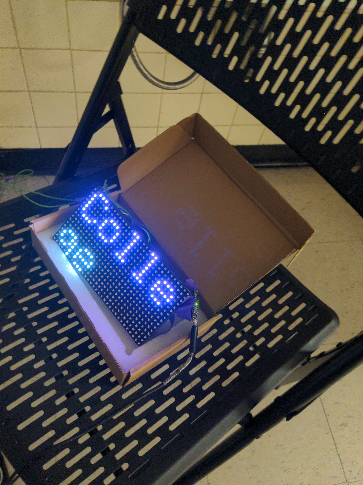

# Control Display
This is a project created for the Foster Laurie School. This repository has the code for three seperate components; an LED Matrix, a host script, and a website (frontend and backend). It also has a small presentation.

You can use the website to display text on the LED Matrix in it's full form. 

# My deployment
I have a deployment sitting at [https://school-demo.sachiniyer.com](https://school-demo.sachiniyer.com)

